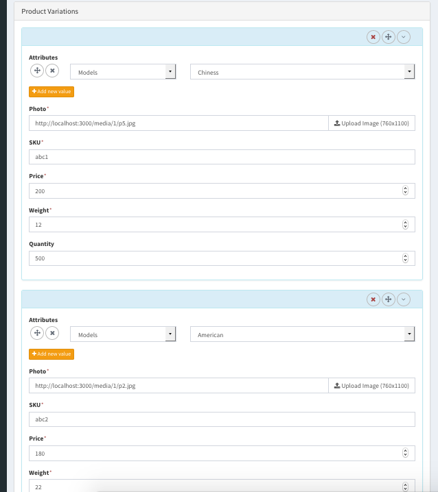

# E-Commerce Plugin
Simple E-Commerce Plugin for [Camaleon CMS](http://camaleon.tuzitio.com).   
This is a simple E-Commerce plugin that permits to start selling in about 10 minutes, because it takes advantage of all features of Camaleon CMS to easy management by admin panel.

## Installation
* Install [Camaleon CMS](https://github.com/owen2345/camaleon-cms#installation)
* Add in your Gemfile
```
gem 'camaleon_ecommerce', '>= 2.0.3'
```
* In your console
```
bundle install
```
* Run migrations
```
rake camaleon_cms:generate_migrations
rake db:migrate
```
* Restart server
```
rails s
```
## Configurations
* Navigate and activate the plugin in http://localhost:3000/admin -> plugins -> ecommerce
* Configure your store
  - Payment Methods
  - Shipping Methods
  - Tax Rates
  - Product Attributes (Optional)
  - Create Products, Categories for products
  - Add your product to your menus (Optional)
  - Create your coupons (Optional)
* Start Selling on http://localhost:3000

## Features
* Easy frontend customization by camaleon-cms themes
* Multi language support
* Multi site support
* Shipping to specific countries
* Multiple currencies conversions for visitors
* Invoices
* Visual customization of email templates
* Multiple Product Variations
* Categories and Tags
* Easy extensible by visual custom fields editor
* Default payments support: Stripe, Bank transfer, On delivery, Paypal, Authorize.net and for custom payment methods:
https://github.com/owen2345/camaleon-ecommerce/blob/master/app/helpers/plugins/ecommerce/ecommerce_functions_helper.rb#L289


## Requirements
* Camaleon CMS >= 2.4.4.3

## Demonstrations
* Example   
  http://store-owen1.tuzitio.com/   
  Test accounts:   
  Authorize.net: 370000000000002 | 09-2019 | 1234   
  Stripe: 4242424242424242 | 09-2019 | 123
* You can create your custom demonstration by the following
  - http://camaleon.tuzitio.com/plugins/demo_manage/
  - Go to admin panel -> plugins and install e-commerce plugin
  - Go to admin panel -> appearances and install e-shop theme
  - Configure your store and enjoy

More information [here](http://camaleon.tuzitio.com/store/plugins/6).   
Sample theme: [here](https://github.com/owen2345/cama-ecommerce-theme)

## Author
Owen Peredo Diaz

## License
http://camaleon.tuzitio.com/license.html

## Contributing
* Fork it.
* Create a branch (git checkout -b my_feature_branch)
* Commit your changes (git commit -am "Added a sweet feature")
* Push to the branch (git push origin my_feature_branch)
* Create a pull request from your branch into master (Please be sure to provide enough detail for us to cipher what this change is doing)
